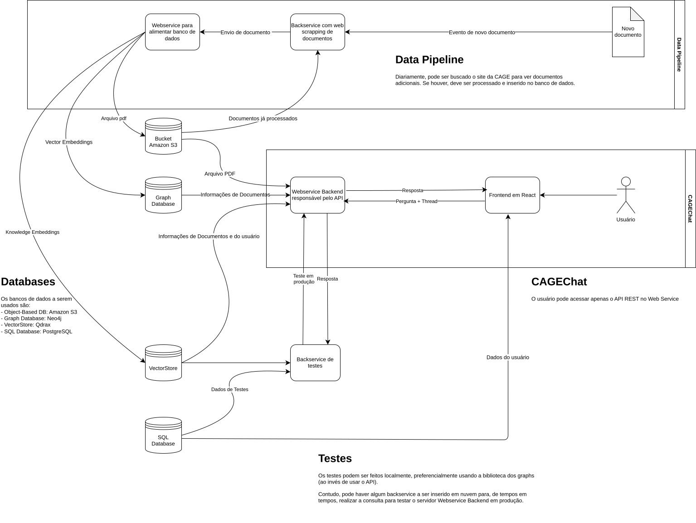
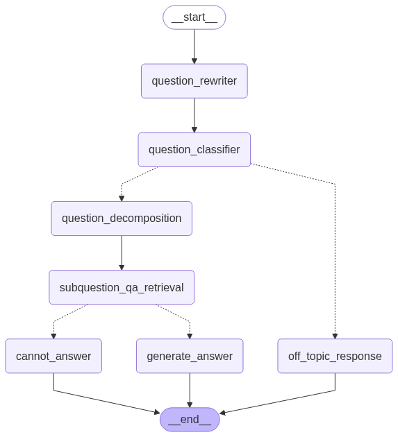
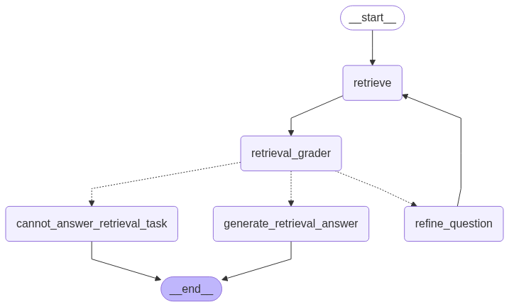
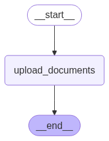

# CAGEChat Project

Welcome to my CAGEChat Project! 

This is a basic project which objective is to build a RAG System for public affais for the Contadorria e Auditoria Geral do Estado do Rio Grande do Sul (CAGE-RS). 


## General Architecture 

<p align='center'>
    
</p>

This system is based on a few components:
a. A Data Pipeline, to add documents and context to the databases [data_pipeline_server]
b. A CAGEChat main system, containing API REST endpoints and a React frontend [backend] [frontend]
c. A Test Pipeline, to allow testing offline (locally, to test new modifications in the code) and online (to assure the system is working as expected) [backend/backend_test]


## Data pipeline server

This is still being constructed. Later I will update this README.md


## CAGEChat Main System

### Backend (API endpoints)

This is a project which main objective is to create a first-version RAG System for the Contadoria e Auditoria Geral do Estado do Rio Grande do Sul. 

The system should be able to integrate many documents, inclusive the following ones:

1. Official Guides and Manuals from CAGE Website <a href='https://cage.fazenda.rs.gov.br/lista/564/publicacoes'> Publicações CAGE </a>
2. Federal and Rio Grande do Sul's Laws;
3. legal opinion issued by the State Attorney General's Office (PGE-RS)
4. Main judges from TCE-RS and TJRS


#### Overview 

The backend is divided into two main LangGraph graphs, a few subgraphs and an API socket generated by FastAPI.

The graphs are present in the backend.modules.graphs.graph.py, whereas the API are coded on the backend.server.api.py.

The project is customized by the config.py file (Setting class), following a similar structure from github <a href='https://github.com/truefoundry/cognita'>Cognita</a>. This is a framework that I'm studying (and maybe should be used in next projects).


In the next sections, I will explain the main graph architectures.


##### **chat_graph**

The 'chat_graph' is the graph responsible for generating the response for questions. It is based on Harish Neel Architecture example referenced in his course (github: <a href='https://github.com/harishneel1/langgraph'>LangGraph Course</a>), using a ReACT structure:

<br><br>

<p align='center'>
    
</p>

<br><br>
The nodes used are:

- **question_rewriter**: responsible for rewritting the user question, appending all relevant historical chat context for a better document retrieve and question processing. 

- **question_classifier**: responsible for classifying the user question, in order to avoid non-related questions for the system. The CAGEChat should be used only for public affairs, not for a general ask. 

- **off_topic_response**: node responsible for returning the final answer for user when the question isn't related to CAGEChat subjects. 

- **question_decompose**: responsible for decomposing the main question into a few related and independent subquestions. 

- **subquestion_qa_retrieval**: responsible for answering the previous generated subquestions, using the retrieval_subgraph. 

*Obs: This is a strategy I've found on the medium article <a href='https://medium.com/data-science/advanced-retrieval-technique-for-better-rags-c53e1b03c183'>Advanced Retrieval Technique for Better RAGs - by Thuwarakesh Murallie</a>. The main objective of this is to improve retrieval results from RAG subgraph by transforming the original question into a few related topics, and then using its answers (and documents) as context to the main answer generator.*


- **generate_answer**: node that generate the final answer when there are enough "question and answer" context to respond the user's question.


- **cannot_answer**: node that generate the final answer when there aren't enough "question and answer" context to respond the user's question. 


##### **retrieval_subgraph**


Inside the main graph, I've created a subgraph specialized on RAG retrieval. This is intended to make RAG a component, which could be used in parallel or be modified without changing the main graph.

Also, there are oportunities to improve the system by making different retrieval subgraph configurations based on the query, vector store or other characteristics. 

<br><br>
<p align='center'>
    
</p>

<br><br>
Then, this subgraph is a component made of the following nodes:


- **retrieve**: node responsible for retrieving the documents relevant to the question. This node should be updated to a subgraph in the next versions, in order to allow the system to retrieve different documents types and reranking them. 

- **retrieval_grade**: node responsible for verify the significance between the documents retrieved and the user question. It allows to reroute the graph, making it able to rewrite the input of the retrieve node in an attempt of better retrieving the documents. 

- **generate_retrieval_answer**: node that generate the final answer when there are enough significant document to answer the subquestion.

- **cannot_answer_retrieval_task**: node that generate the final answer when there aren't enough significant document to answer the subquestion. It is routed to after a few attempts to change the question and re-retrieve. 

- **refine_question**: node that tries to redo the subquestion in order to achieve better RAG results. This is done until reaches a better retrieval result or a few tries have been done. 


##### **upload_graph**

The 'upload_graph' is a LangGraph Graph responsible for indexing and saving documents in the VectorStore. It is a secundary, but extreme important, graph for the CAGEChat system. 


<p align='center'>
    
</p>

<br><br>
Nowadays, it is still basic, using the LangGraph framework in order to embedding and indexing tasks. 


#### FastAPI endpoints 

The CAGEChat Backend is used by API endpoints, provided in order to accept a cloud deploy and to allow many nodes (kubernetes).

Although the aim of this project isn't become production-ready, I felt I should use API in order to allow to use this as MVP (when used by a frontend application).

The API endpoints present in this project are:


##### GET(/chat_stream/)

This is the main endpoint, where the user/frontend system should send GET requests with the following parameters:

- message: the user's question
- [OPTIONAL] checkpoint_id: the thread id used to allow chat conversation (save checkpoints to the chat)


##### POST(/upload_file/)

This is the endpoint used to upload files for the 'upload_graph', accepting the POST requests with the following parameters:

- file: file uploaded in the request
- metadata: json containing the metadata of the file (used to improve the retrieve and the identification of the source). This should have at least the key "tipo_documento", which accepts: "manuais", "leis", "pareceres", "jurisprudência". 


### Frontend

I Haaaaaaaaaate this part. But it is necessary.

So, I've spent a few days of my life writing a basic REACT client, with Cursor and ChatGPT assistance, which should be enough for users to try and contribute to the project. Please forgive me! 😅 

#### Overview

CAGEChat is a web application designed to assist with legal norm consultations. 
This frontend client is built with React and provide a way to users interact with the RAG System.


#### Features

- **Chat Interface**: Communicate with an AI assistant specialized in legal norms
- **Question Collector**: Contribute to the project by submitting legal questions and answers
- **Conversation History**: Access previous chat sessions
- **Responsive Design**: Works on desktop and mobile devices

#### Project Structure

The frontend is organized as follows:

- `src/`
  - `assets/`: Contains images and icons
  - `components/`: Reusable React components
  - `pages/`: Main application pages
  - `styles/`: CSS files for styling
  - `App.js`: Main application component
  - `index.js`: Entry point

#### Key Components

- **ChatPage**: Main interface for interacting with the AI
- **QuestionCollector**: Interface for contributing legal questions and answers
- **Sidebar**: Navigation component for accessing different parts of the application
- **AboutSection**: Information about the project and its purpose

#### API Integration

The frontend communicates with the backend through several API endpoints:

- `/chat_stream/`: Streaming endpoint for real-time chat responses
- `/add_question/`: Endpoint for submitting new questions to the database
- `/get_all_questions_from_user/`: Retrieves user-specific questions

#### Getting Started

##### Prerequisites

- Node.js (v14 or higher)
- npm or yarn

##### Installation

1. Clone the repository
2. Navigate to the frontend directory:
   ```
   cd frontend_react/client
   ```
3. Install dependencies:
   ```
   npm install
   ```
4. Start the development server:
   ```
   npm start
   ```


## Test Pipeline and Evaluation Metrics

The CAGEChat system includes an automated test pipeline to evaluate the quality and reliability of its answers. This pipeline uses a set of metrics to assess different aspects of the system's responses, helping to identify strengths and areas for improvement.

### How the Test Pipeline Works

- The test pipeline runs a series of predefined question-answer cases through the backend.
- For each test case, the system generates an answer and retrieves supporting documents.
- Several evaluation metrics are computed for each response, providing a quantitative assessment of the system's performance.
- The results are aggregated and visualized to help analyze the system's behavior.

### Evaluation Metrics

The following metrics are used to evaluate the system:

- **Context Precision**: Measures how much of the retrieved context is relevant to the user's question. High precision means the system retrieves mostly useful information.
- **Faithfulness**: Assesses whether the answer is factually supported by the retrieved documents. A faithful answer does not introduce information not present in the sources.
- **Response Relevancy**: Evaluates how relevant the answer is to the user's question, regardless of the context.
- **Response Groundedness**: Checks if the answer is grounded in the provided context, ensuring the response is based on the retrieved documents.
- **Answer Accuracy**: Compares the system's answer to a reference answer, measuring how correct and complete the response is.
- **Context Relevancy**: Measures how relevant the retrieved context is to the question, similar to context precision but with a focus on overall usefulness.

These metrics are computed automatically using the [RAGAS](https://github.com/explodinggradients/ragas) evaluation framework and custom logic.

### Running the Test Pipeline

To run the test pipeline:

1. Prepare a folder with test cases (questions, reference answers, etc.).
2. Execute the test pipeline script in the backend (`backend_test/test_pipeline.py`).
3. The pipeline will process the test cases, compute the metrics, and display summary statistics and plots for each metric.

This evaluation process helps ensure that CAGEChat provides accurate, relevant, and well-supported answers, and guides future improvements to the system.


## Contributors

Although this is a project for studying, my objective is to improve this for a future MVP test. To accomplish this, I really need help to improve too many areas. 

A few areas of improvement are:

- Insert RAGAS (or other eval framework) to continuous evaluation of the system
- Add NoSQL Databases connection to save the documents (and avoid recreating docs)
- Add unit tests to the system 
- Add evaluation tool in order to optimize the hyperparameters
- Add fine-tuning for models
- Add questions and answers for system evaluation

Please feel free to contribute to this! For more information about how to contribute, please run the frontend client and click on "Ajude o Projeto!" or "Sobre o projeto".
